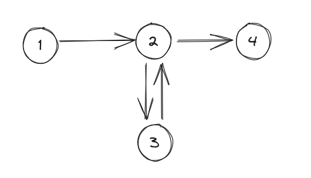

**Problem**

- Given an undirected graph, direct its edges such
  that there is no path of length 2 or greater.

  Obs:
  - For each vertex, either all edges are incoming or
    all edges are outgoing. Otherwise, there will be
    a path of length $2$.
  - If there is any cycle of odd length in the undirected
    graph, i.e, not a bipartite graph, then it will
    not be possible since the edges in the cycle
    will be alternating in direction.
  - Thus, if the given undirected graph is bipartite
    then make all edges point from one set to another.

***

**Problem**

Given a connected weighted undirected graph of $N$ nodes
$1,\ldots,N$ and $M$ edges $(u_i, v_i, w_i)$ for $i = 1,\ldots,M$
, find
the length of a shortest path which visits each
node at least once.

We have $1 \le N \le 16$ and $1 \le w_i \le 10^9$

**Solution**

(DP with bitmask)

***

**Problem**

Given an unweighted, undirected graph with $N$
vertices and $M$ edges. Find the number of paths
which start at vertex $1$ and visit other vertices
exactly once.

We have: $2 \le N \le 8$,
$0 \le M \le N \cdot (N-1)/2$

**Solution**

> This problem is almost same as finding number of Hamitonian
  cycles starting from a given vertex

Let $f(u, S)$ be the number of paths from $1$ to
$u$ visiting each vertex in $S$ exactly once 
(it must hold that $1, u \in S$).

Let $V = \{1, \ldots, N\}$. We need to find:

$$
\sum_{2 \le i \le N}{f(u, V)}
$$

$f$ can be defined recursively (let $E$ be the set of edges):

$$
f(u, S) = \sum_{v \in S, (u, v) \in E}{f(v, S - \{u\})}
$$

We have base cases:

$$
f(i, \{i\}) = 
\begin{cases}
1 & \text{if } i = 1 \\
0 & \text{otherwise}
\end{cases}
$$

We can solve the problem using this recurrence,
by memoization, in $O(N^2 2^N)$.

Since the max value of $N$ is very small this 
problem can also be solved by recursion in $O(N!)$
time.

***

### Euler paths

An Euler path (in a directed graph) starts and ends at possibly
different vertices and visits each edge exactly once.

Some important properties:

- For any vertex $u$ except for initial and final vertex
  - $n_i(u) = n_o(u)$ (number of incoming and outgoing edges)
- Assuming initial vertex $s$ is not same as final vertex $t$, then:
  - $n_i(s) + 1 = n_o(s)$
  - $n_i(t) = 1 + n_o(t)$
- In case $s = t$, then it is a *Euler tour* or *Euler cycle*
  and the first point holds for $s, t$ as well.

Finding a Euler's path:
- Suppose the above condtions are satisfied and $s \neq t$.



Here, $s = 1$ and $t = 4$.

If we make arbitrary choices of edges in the path,
we may end up at $t$ without visiting all edges.
For example, in the graph above we may visit $[1, 2, 4]$
instead of $[1, 2, 3, 4]$.

We can incrementally build the path in this way:
- First start from $s$ and it is guaranteed that we will end up at $t$.
  Let the path be $[p_1, \ldots, p_k]$ where $p_1 = s$ and $p_k = t$.
- Let $p_i$ be some vertex which has an unvisited outgoing edge.
  If we start with that edge from $p_i$, we are guaranteed to end up
  at $p_i$, let that cycle be $[p_i, x_1, \ldots, x_m, p_i]$
- We will integrate this path within our main path:
  $[p_1,\ldots,p_i,x_1,\ldots,x_m,p_i,\ldots,p_k]$
- We will repeat this process until there is no such vertex.
  If there are unvisited vertices at this point, then
  those vertices are unreachable from the visited vertices.

Implementation wise, this simple DFS returns a **reversed** Euler's path:
```
dfs(u):
  for v in adj[u]:
    remove v from adj[u]
    dfs(v)
  ans.append(u)
```

### Illustration: Find Euler path forming smallest sequence

Path $p$ is smaller than $q$ if $p_i = q_i$ for $i$ to some $t-1$
and $p_t \lt q_t$

We will start from $s$ and choose the vertex having
least value among the choices. Let the path be $p$
when we end up at $t$ (there might be some unvisited edges/vertices)

Let the optimal solution be $s$.
Prefix of $s$ (having same size as $p$) will never be smaller than $p$.

Now, we have to insert the cycles which were left out.
Given that nature of comparison here, we will prefer not
to modify the earlier part of the sequence. Thus we will
start from the latest vertex in path $p$ which
has an unvisited edge. We will then follow the same strategy
of smallest choice to form a cycle.

We have not provided proof here, but the following
help in understanding:
- Suppose the optimal solution $s$ and $p$ differ at $i$.
  Suppose $s_i \lt p_i$. It has to be the case that a cycle
  was inserted in $p$ at $i$. Now we can not 'not' insert
  the cycle here because all later vertices have been processed already
  and did not cover all unvisited edges.

Implementation: we simply change the order of
visiting in the above `dfs`.

***